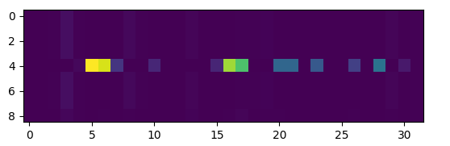
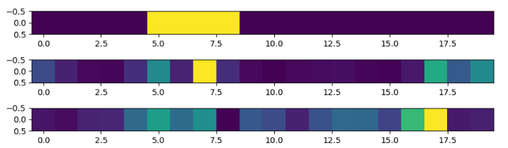
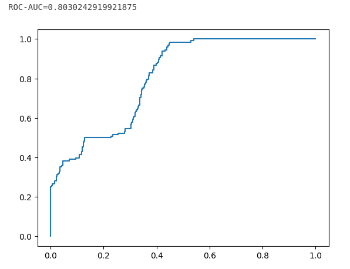

# filtering_context_with_delta_from_mamba

В этом репозитории содержится код экспериментов для дипломной работы "Фильтрация контекста с помощью больших языковых моделей",
в которой изучалось, может ли интерпретация внутренних предствалений языковой модели архитектуры mamba помочь в фильтрации контекста.

Эксперименты делятся на 3 основные части:
1. Обучение маленьких mamba с нуля на синтетических датасетах Selective Copying и Induction Heads, и анализ связи параметра $\Delta$ и важности токена
2. Разметка реального датасета от explyt с помощью генеративных моделей и анализ качества разметки
3. Извлечение $\Delta$  из предобученной большой модели mamba и анализ его связи с релевантностью контекста

## 1 - синтетические датасеты

Файлы:

* ***my_mamba.py*** - изменённая реализация mamba из библиотеки [mambapy](https://github.com/alxndrTL/mamba.py), таким образом, что модель возвращает не только выходы, но и $\Delta$

* остальные файлы - эксперименты, в каждом файле один эксперимент, параметры экспериментов указаны в названии файлов

Содержание каждого файла:
1. Общий код для всех экспериментов для запуска, обучения и тестирования модели mamba
2. Обучение модели до тех пор, пока лосс (кросс-энтропия) не станет меньше 1e-4.
3. Карта $\Delta$ обученной модели: по вертикальной оси отложен номер токена в последовательности, по горизонтальной - компоненты $\Delta$ (все, без усреднений)

4. Диаграмма, на которой отложены токены. На верхней картинке жёлтым выделены важные токены (которые модель должна запомнить). На второй - средние $\Delta$ для каждого токена (усреднение карты $\Delta$ из прошлого пункта по горизонтали). На третьей - максимальные $\Delta$ для каждого токена.

5. ROC-кривая для классификации важности токена по величине $\Delta$ и ROC-AUC

6. Обучение бустинга предсказывать по $\Delta$ важность токена, accuracy на тестовых данных для него и ROC-кривая

## 2 и 3 - реальные данные

В директории ***preprocess_real*** содержится код для предобработки данных и генерации промптов для моделей, а также файл ***deepseekV3_answers.txt***, содержащий ответы модели deepseek-V3 на этих промптах, забитых в модели вручную.

В директории ***2_3_real*** содержится основной код для проведения экспериментов и анализа результатов. Кроме того, часть экспериментов была проведена на kaggle.

Где какие эксперименты лежат:

* ***main.ipynb*** - содержит финальный анализ результатов для генеративных моделей и для извлечённых средних $\Delta$ большой модели mamba

* ***data.pkl*** - обработанный датасет от explyt, куда были подмешаны части кода из других проектов (заведомо нерелевантные)

* ***preds.pkl*** - предсказания маленьких генеративных моделей, которые я запускал локально в файле ***run_models.ipynb***. Из них единственная более-менее адекватно справившаяся модель - *deepseek-coder-V2-light* на 16 миллиардов параметров.

* ***mamba_outputs_with_mean_dt.pkl*** - извлечённые delta при запуске модели falcon3-mamba на 7 миллиардов параметров на обработанном датасете (*data.pkl*). Сам код по извлечению этих delta лежит на kaggle: [***здесь***](https://www.kaggle.com/code/kirill2393/extract-falcon-mamba-delta). В kaggle загружен датасет *extracting-falcon-mamba-dt*, использующийся в качестве входа, и внём есть 2 файла: *data.pkl* (датасет) и ***modeling_falcon_mamba.py*** - изменённая реализация модели с извлечением delta

* визуализация delta из модели falcon3-mamba на простом примере также лежит на kaggle:
[***здесь***](https://www.kaggle.com/code/kirill2393/show-falcon-mamba-delta)
